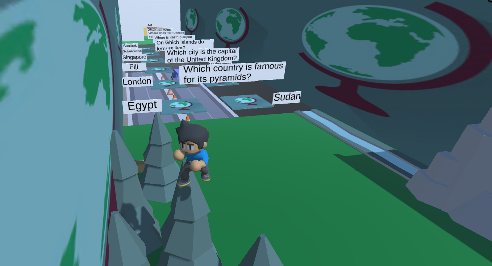
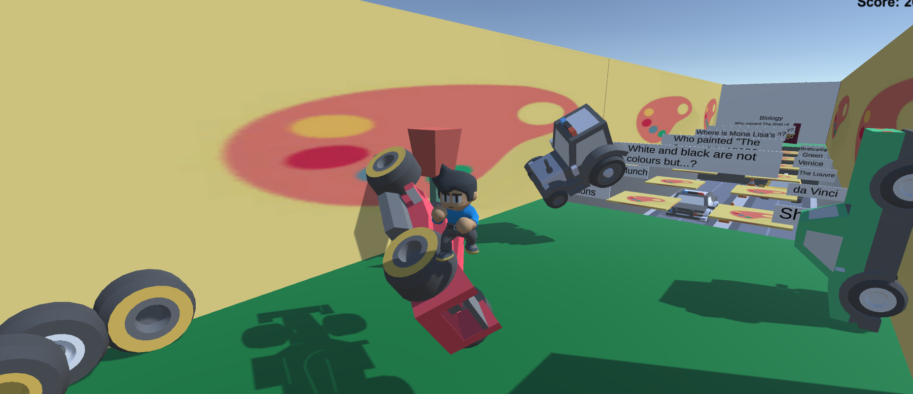
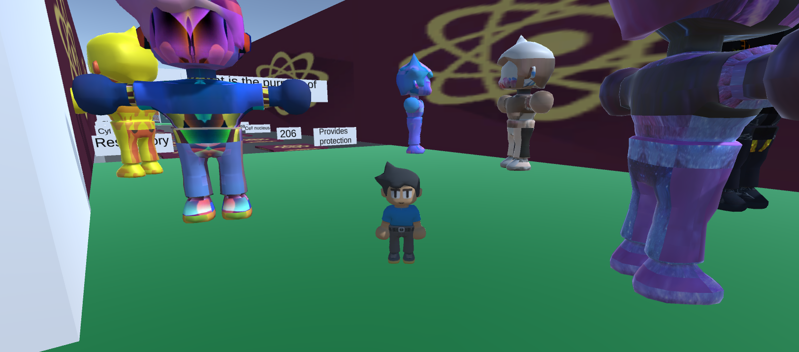
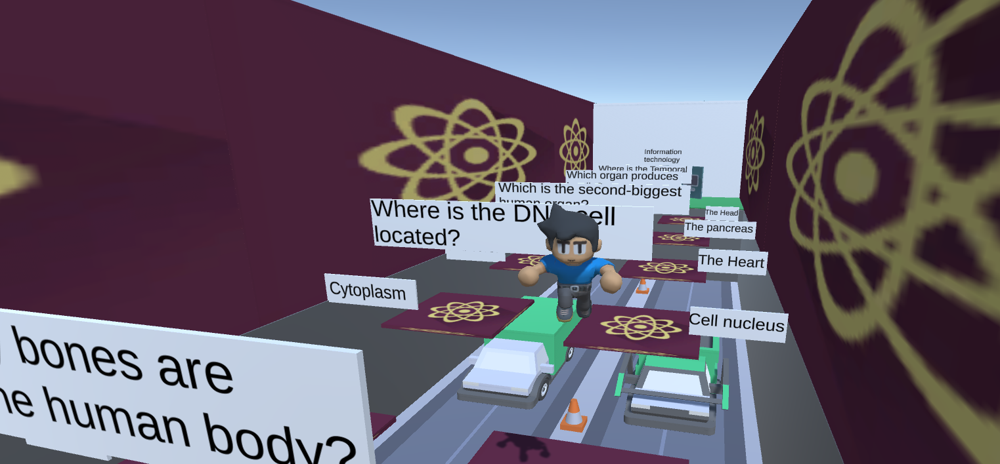

Eeducational 3D platform game, where the player controls a character and goes through multiple sections of different questions. 

Each question has 2 platforms with answers. The platform with the correct answer will allow the player to continue.
While the platform with the wrong answer is fake and it will make the character fall through and lose a life.

The goal of the game is to correctly answer all the questions and reach the end with limited lives. The idea behind 
it is to make players engaged, test their knowledge and learn in a fun way.

